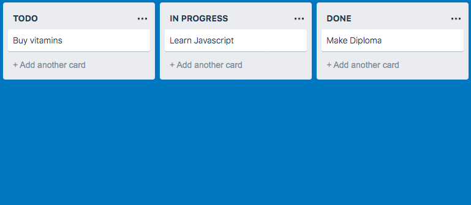

# Trello.
### Проект по курсу "Продвинутый Javascript в браузере" (Нетология).

Ссылка на опубликованный [проект](https://queenarizona.github.io/Trello/).

[](https://ci.appveyor.com/project/QueenArizona/trello)

Основная задача проекта - сделать упрощённую систему управления текстовыми задачами, применив подход, который используется в [Trello](https://trello.com):



Реализованные задачи:
* Добавление карточки с помощью кнопки 'Add another card'
* Удаление карточек - при наведении на карточку появляется иконка крестик, при нажатии на которую карточка удаляется
* Перемещение карточки как внутри колонки, так и между колонками
* Сохранение положения курсора по отношению к карточке при её перемещении
* Хранение состояния в LocalStorage так, чтобы после обновления страницы внесённые изменения сохранялись
* Построение DOM-дерева на базе состояния, хранящегося в LocalStorage

Для установки зависимостей и запуска проекта локально используются команды:

```sh
$ yarn
$ yarn run start
```

Документация собирается при помощи JSDoc:
```sh
yarn run doc
```
